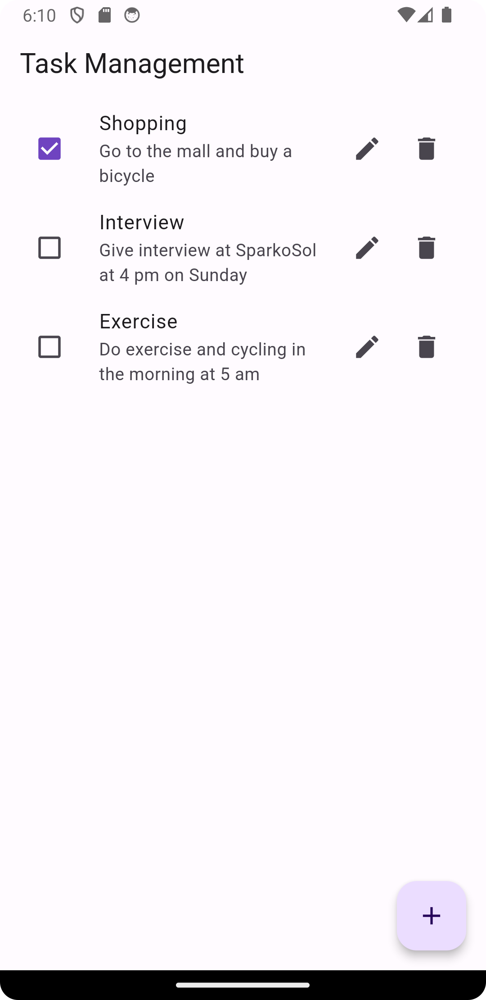
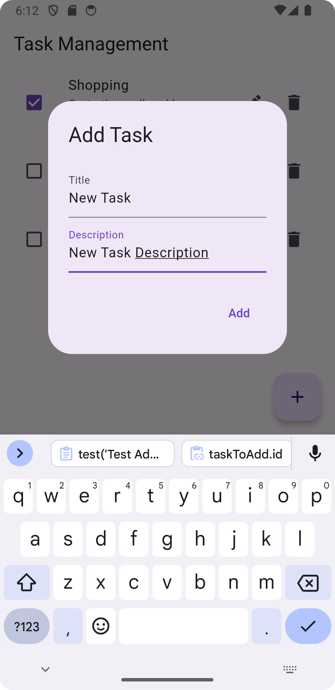
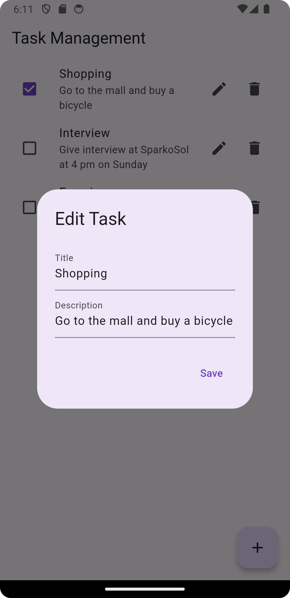
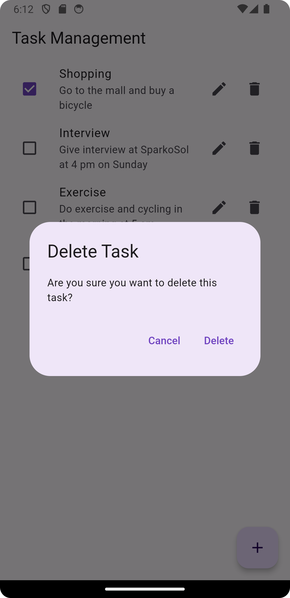

# Task Management App

## Overview
Welcome to the Task Management App! This project is a task management application built using the Flutter framework. It follows the principles of Clean Architecture and utilizes the Riverpod state management solution. Additionally, it employs an in-memory mock database to simulate backend operations using Sqflite.

## Features
- Add, edit, and delete tasks
- Persistent in-memory data storage using Sqflite

## Architecture
This project is designed following the Clean Architecture principles, which ensure separation of concerns and scalability. The main layers of the architecture are:

- **Presentation Layer**: Contains the UI code (widgets and screens) and handles user interactions.
- **Domain Layer**: Contains business logic and domain entities.
- **Data Layer**: Handles data fetching and manipulation. This includes repositories and data sources (in-memory database in this case).

### State Management
The application uses Riverpod for state management, which provides a robust and scalable way to manage state across the app.

### In-Memory Database
Sqflite mock database is used to simulate the backend. This allows for testing and development without needing a real database.

## Screenshots

### Task List Screen

### Add Task Screen

### Edit Task Screen

### Delete Task Confirmation

## Contact
For any questions or suggestions, please feel free to open an issue or contact me at [engr.usmanch26@gmail.com](mailto:engr.usmanch26@gmail.com).

Happy coding!
